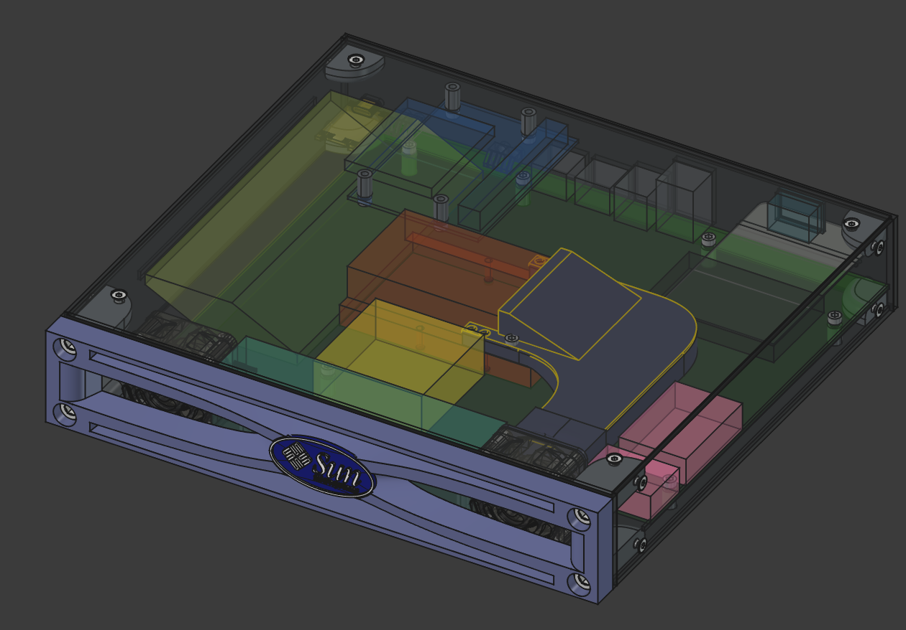

# SunFire V100 10 Inch Case

This repository contains the FreeCAD 3D models of a compact 10‑inch enclosure for a SunFire V100.

## What's inside

* `sun-v100-10inch-case.FCStd` – main FreeCAD project/assembly
* `parts/` – parametric part files (brackets, panels, air duct, bezel, standoffs, logo)

## License

Sun v100 10 inch Case 3D model © 2025 by kakwa is licensed under `CC BY-SA 4.0`.

To view a copy of this license, visit [https://creativecommons.org/licenses/by-sa/4.0/](https://creativecommons.org/licenses/by-sa/4.0/).
